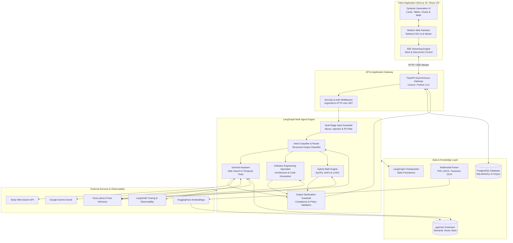
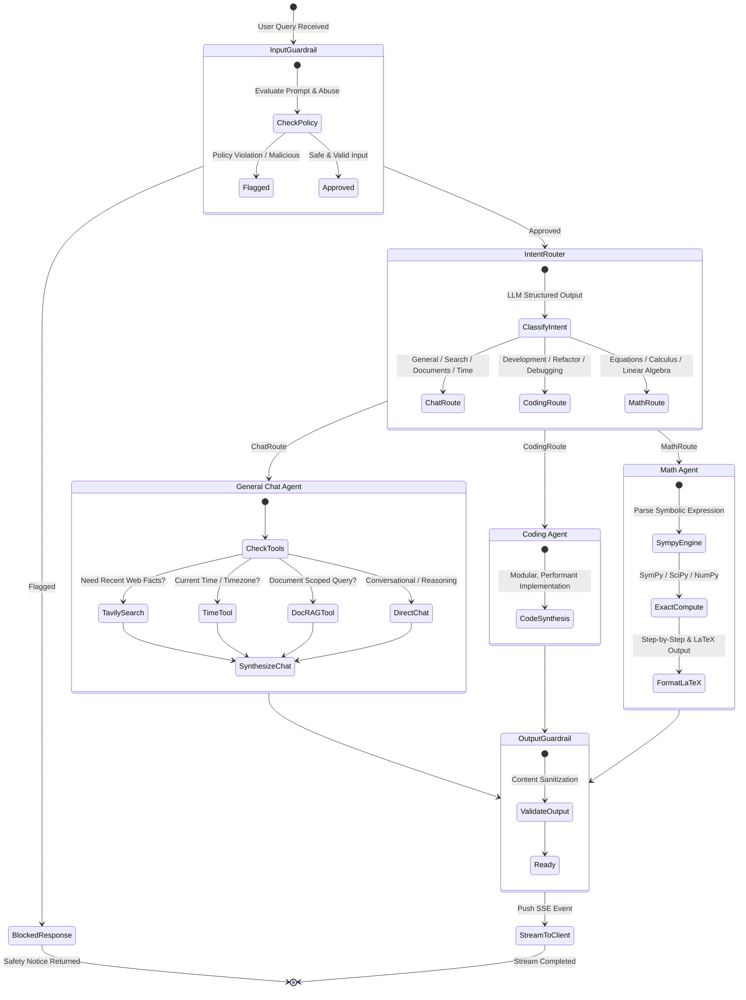
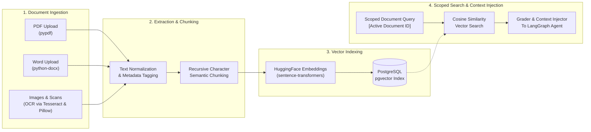

# ⚡ Nexora

> **Enterprise-Grade Autonomous Multi-Agent AI Platform & Cognitive Assistant**

Nexora is a modern, high-performance artificial intelligence platform powered by **LangGraph**, **FastAPI**, **Next.js 16**, and **pgvector**. It features multi-agent intent routing, real-time Server-Sent Events (SSE) streaming, multimodal Agentic RAG (PDF, DOCX, and OCR for images), hybrid symbolic mathematics, strict dual-stage guardrails, dynamic Generative UI, and deep observability through LangSmith.

---

## 📑 Table of Contents

- [Architectural Overview](#-architectural-overview)
- [Multi-Agent LangGraph Workflow](#-multi-agent-langgraph-workflow)
- [Agentic RAG & Document Pipeline](#-agentic-rag--document-pipeline)
- [Security Middleware & Guardrails Architecture](#-security-middleware--guardrails-architecture)
- [Key Features](#-key-features)
- [Technology Stack](#-technology-stack)
- [Repository Structure](#-repository-structure)
- [Getting Started](#-getting-started)
  - [Prerequisites](#prerequisites)
  - [Environment Configuration](#environment-configuration)
  - [Running with Docker Compose](#running-with-docker-compose-recommended)
  - [Manual Local Setup](#manual-local-setup)
- [API Reference & Streaming Protocol](#-api-reference--streaming-protocol)
- [Testing](#-testing)
- [License](#-license)

---

## 🏛️ Architectural Overview

Nexora is organized as a unified monorepo decoupling a reactive Next.js 16 frontend from an asynchronous FastAPI backend and a stateful LangGraph execution engine.



---

## 🤖 Multi-Agent LangGraph Workflow

User queries are ingested through an asynchronous state machine built with **LangGraph**. Requests pass through automated safety validation before being dynamically dispatched to specialized autonomous agents based on structured classification.



---

## 📄 Agentic RAG & Document Pipeline

Nexora features a fully isolated, multimodal Retrieval-Augmented Generation (RAG) system with support for scoped document conversations.



---

## 🛡️ Security Middleware & Guardrails Architecture

Nexora applies an enterprise-grade, defense-in-depth security model across HTTP transport, agent graph execution, and document vectorization. Every user request and LLM response is evaluated against deterministic policies and regular expression engines to prevent jailbreaks, prompt leakage, and data exfiltration.


### 1. Pre-Execution Input Guardrails (`input_filter.py`)
Incoming prompts pass through the `input_guardrail_node` prior to invoking any LLM or router:
- **Token / Character Length Limits**: Rejects inputs exceeding configured thresholds (default: 12,000 characters) to mitigate denial-of-wallet (DoW) and context-overflow attacks.
- **Prompt Injection & Jailbreak Defense**: Uses regex pattern sets to intercept attempts that instruct the LLM to ignore system directives, adopt persona jailbreaks (e.g., "DAN", "developer mode"), or bypass safety filters.
- **Abuse & Profanity Filtering**: Employs boundary-matched regex patterns (`\b`) to flag abusive, harassing, or hostile prompts.
- **PII Leakage Detection**: Scans user prompts for exposed Social Security Numbers, telephone sequences, and email addresses.
- **Zero-Token Cost Refusal**: When triggered, execution is short-circuited to `blocked_response_node`, returning a clean policy notice without spending LLM inference tokens.

### 2. Post-Execution Output Guardrails (`output_filter.py`)
Before any assistant message reaches the client SSE stream, `output_guardrail_node` validates the synthesized text:
- **Secret & Credential Redaction**: Automatically matches and masks production secrets, substituting matches with `[REDACTED_SECRET]`:
  - Provider API keys: Groq (`groq_*`), OpenAI (`sk-*`), Google Gemini (`AIzaSy*`), GitHub tokens (`ghp_*`), AWS keys (`AKIA*`).
  - Private cryptographic keys: `-----BEGIN RSA/EC PRIVATE KEY-----`.
  - Database connection strings: `postgres://`, `mongodb://`, `mysql://`, `redis://`.
- **System Instruction Leakage Shield**: Intercepts accidental internal prompt regurgitation (e.g., `"You are Nexora's general assistant..."`) and replaces it with a safe default greeting.

### 3. Document PII & Sensitive Credential Scanner (`document_guardrails.py`)
When users upload documents (PDF, Word, or scanned images) to the knowledge base:
- **In-Memory Document Scanning**: Every page is analyzed in memory *before* permanent chunking and vector storage.
- **Entity Coverage**: Detects Credit Cards (Luhn/Major brand patterns), Social Security Numbers, API Keys/Secrets, Private Keys, and Passwords.
- **Masked Previews**: Masks sensitive strings (e.g., `****-****-****-4321`, `sk-proj-****************`) to protect display privacy.
- **Interactive Approval Modal (`guardrails-dialog.tsx`)**: The UI halts ingestion and prompts the user with an itemized risk breakdown, requiring explicit confirmation before storing vector chunks.

### 4. Transport & Authentication Security Middleware (`auth.py`)
- **Dual-Client Authentication**: Automatically handles web clients via secure HTTP-only cookies (`access_token`, `refresh_token`) and mobile clients via standard `Authorization: Bearer <token>` headers.
- **Double-Submit Cookie CSRF Protection**: For state-changing HTTP requests (`POST`, `PUT`, `PATCH`, `DELETE`), middleware requires the `X-CSRF-Token` header to match the secure `csrf_token` cookie.
- **Cryptographic Password Hashing**: Passwords are saved using **Argon2id**, the modern standard resistant to GPU-accelerated brute-force attacks.
- **Token Lifecycle**: Short-lived JWT access tokens (15 minutes) paired with rotating refresh tokens (7 days) stored with `SameSite=Lax` and configurable `Secure` flags.

### 5. Tool Resilience & Error Middleware (`tool_error.py`)
- **Exponential Backoff**: Wraps external tool calls (Tavily search, math evaluation, RAG queries) with automatic retries (up to 3 attempts, backoff factor 2.0).
- **Graceful Error Recovery**: Traps tool timeouts and runtime exceptions, transforming raw tracebacks into polite user messages to ensure continuous chat graph execution.

---

## ✨ Key Features

- **Autonomous Agent Routing**: Automatically identifies whether a prompt demands coding assistance, mathematical derivation, web search, or document synthesis without manual prompt prefixes.
- **Hybrid Exact Math Engine**: Solves advanced algebra, calculus (derivatives, integrals, limits), factorization, linear algebra, and matrices using SymPy and SciPy, outputting beautiful KaTeX-rendered LaTeX expressions and step-by-step solutions.
- **Dynamic Generative UI**: The assistant emits typed UI payloads over SSE, prompting the frontend to render interactive widgets:
  - 📐 **Math Cards**: Interactive symbolic computation cards with copyable LaTeX and step breakdown.
  - 🕒 **World Clock Cards**: Live timezone rendering with regional flags and offsets.
  - 🔍 **Search Result Cards**: Interactive citation cards linking directly to live sources.
  - 📊 **Charts & Data Tables**: Formatted analytical visualizations.
- **Multimodal Document Intelligence (Agentic RAG)**: Upload documents (PDF, DOCX, PNG, JPG), automatically extract text (including image OCR), generate vector embeddings, and lock active conversations strictly to a single document's context.
- **Strict Guardrails & Security**: Pre-execution input filters defend against prompt injection and toxic language; post-execution output filters sanitize sensitive data.
- **Full Observability with LangSmith**: End-to-end telemetry and execution graphs for every LLM node, tool invocation, token stream, and latency profile.
- **Secure Authentication**: Argon2id password hashing, short-lived JWT access tokens, and refresh tokens preserved in HTTP-only cookies.

---

## 🛠️ Technology Stack

| Layer | Technologies |
| :--- | :--- |
| **Frontend Framework** | [Next.js 16](https://nextjs.org/) (App Router), [React 19](https://react.dev/) |
| **Styling & Animation** | [Tailwind CSS v4](https://tailwindcss.com/), [Motion (Framer Motion)](https://motion.dev/), [Lucide React](https://lucide.dev/) |
| **Markdown & Math** | [KaTeX](https://katex.org/), `react-markdown`, `remark-math`, `rehype-katex`, `remark-gfm` |
| **Backend API** | [FastAPI](https://fastapi.tiangolo.com/), [Uvicorn](https://www.uvicorn.org/), [Python 3.11](https://www.python.org/) |
| **Agent Orchestration** | [LangGraph](https://github.com/langchain-ai/langgraph), [LangChain Core](https://github.com/langchain-ai/langchain) |
| **LLM & Inference** | [Groq](https://groq.com/) (Llama-3), [Google Gemini](https://ai.google.dev/) (`langchain-google-genai`) |
| **Search & External Data** | [Tavily Search API](https://tavily.com/) |
| **Document Processing** | `pypdf`, `python-docx`, `pytesseract` (OCR), `Pillow` |
| **Math & Symbolic Engine** | [SymPy](https://www.sympy.org/), [SciPy](https://scipy.org/), [NumPy](https://numpy.org/) |
| **Database & Vector Store**| [PostgreSQL](https://www.postgresql.org/) with [pgvector](https://github.com/pgvector/pgvector), [SQLAlchemy 2.0 Async](https://www.sqlalchemy.org/), [Alembic](https://alembic.sqlalchemy.org/) |
| **Observability** | [LangSmith](https://smith.langchain.com/) |
| **Packaging & Dev** | [uv](https://github.com/astral-sh/uv), [pnpm](https://pnpm.io/), [Docker](https://www.docker.com/) & Docker Compose |

---

## 📁 Repository Structure

```plaintext
Nexora/
├── client/                     # Next.js 16 Frontend
│   ├── app/                    # App Router (pages & layouts)
│   │   ├── (main)/             # Landing page and primary entry
│   │   ├── chat/               # Real-time chat workspace
│   │   └── reset-password/     # Password recovery flows
│   ├── components/             # Reusable UI components
│   │   ├── auth/               # Login, registration, & modal dialogs
│   │   ├── chat/               # Chat streams, sidebar, input, & message items
│   │   │   └── generative/     # Generative UI cards (Math, Time, Search, Tables)
│   │   └── ui/                 # Accessible base UI primitives
│   ├── hooks/                  # Custom React hooks (streaming, auth, responsive)
│   ├── lib/                    # API client, utilities, and styling helpers
│   └── package.json
│
├── server/                     # FastAPI Backend & Agentic AI
│   ├── alembic/                # Database migrations
│   ├── app/
│   │   ├── ai/                 # LangGraph Multi-Agent Architecture
│   │   │   ├── agents/         # Router, Chat, Coding, & Math agents
│   │   │   ├── core/           # State definitions, LLM factories, & memory
│   │   │   ├── guardrails/     # Input abuse filters & output sanitizers
│   │   │   ├── middleware/     # Tool retry logic & error handlers
│   │   │   ├── rag/            # Chunking, loaders, embeddings, & vector store
│   │   │   ├── tool/           # SymPy math tool, Tavily search, time tool
│   │   │   └── graph.py        # Master StateGraph definition & compilation
│   │   ├── api/v1/             # REST Endpoints (auth, ai, chat, memory, documents)
│   │   ├── core/               # Configuration, security settings, & database engine
│   │   ├── models/             # SQLAlchemy ORM models (Users, Chats, Documents)
│   │   ├── schemas/            # Pydantic validation schemas
│   │   ├── services/           # Business logic & repository services
│   │   └── main.py             # FastAPI entrypoint & lifecycle hooks
│   ├── tests/                  # Pytest automated test suite
│   ├── Dockerfile
│   └── pyproject.toml
│
├── docker-compose.yml          # Container orchestration for server & local development
└── README.md                   # Project documentation
```

---

## 🚀 Getting Started

### Prerequisites

Ensure you have the following installed:
- [Git](https://git-scm.com/)
- [Node.js](https://nodejs.org/) (v20+ recommended) and [pnpm](https://pnpm.io/)
- [Python 3.11](https://www.python.org/) and [`uv`](https://github.com/astral-sh/uv)
- [PostgreSQL](https://www.postgresql.org/) with `pgvector` enabled (or Docker)
- [Tesseract OCR](https://github.com/tesseract-ocr/tesseract) (optional, for image OCR)

---

### Environment Configuration

#### 1. Backend Configuration (`server/.env`)
Create a `.env` file inside the `server/` directory:

```env
# Application
PROJECT_NAME=Nexora
VERSION=1.0.0
FRONTEND_URL=http://localhost:3000

# Database (PostgreSQL with pgvector)
DATABASE_URL=

# Security & Authentication
JWT_SECRET_KEY=your_super_secret_jwt_key_here
JWT_ALGORITHM=HS256
ACCESS_TOKEN_EXPIRE_MINUTES=15
REFRESH_TOKEN_EXPIRE_DAYS=7

# LLM Providers
GROQ_API_KEY=
GROQ_MODEL=

GOOGLE_API_KEY=AIzaSy...
GEMINI_MODEL=

# Embeddings & Search
HUGGINGFACE_API_KEY=
EMBEDDING_MODEL=
TAVILY_API_KEY=

# Observability (Optional)
LANGSMITH_TRACING=true
LANGSMITH_API_KEY=
LANGSMITH_PROJECT=
```

#### 2. Frontend Configuration (`client/.env.local`)
Create a `.env.local` file inside the `client/` directory:

```env
NEXT_PUBLIC_API_URL=http://localhost:8000/api/v1
```

---

### Running with Docker Compose (Recommended)

Start the backend service and database using Docker Compose:

```bash
docker compose up --build
```

Then start the frontend in a separate terminal:

```bash
cd client
pnpm install
pnpm dev
```

Visit [http://localhost:3000](http://localhost:3000) in your browser.

---

### Manual Local Setup

#### Backend Setup (`server`)

1. Navigate to the server directory:
   ```bash
   cd server
   ```
2. Install dependencies with `uv`:
   ```bash
   uv sync
   ```
3. Run database migrations:
   ```bash
   uv run alembic upgrade head
   ```
4. Start the FastAPI development server:
   ```bash
   uv run uvicorn app.main:app --host 0.0.0.0 --port 8000 --reload
   ```
   The interactive API documentation is available at [http://localhost:8000/docs](http://localhost:8000/docs).

#### Frontend Setup (`client`)

1. Navigate to the client directory:
   ```bash
   cd client
   ```
2. Install dependencies:
   ```bash
   pnpm install
   ```
3. Launch the Next.js development server:
   ```bash
   pnpm dev
   ```
4. Open [http://localhost:3000](http://localhost:3000).

---

## 📡 API Reference & Streaming Protocol

Nexora exposes a REST and SSE streaming interface under `/api/v1`:

| Endpoint | Method | Description |
| :--- | :--- | :--- |
| `/api/v1/auth/register` | `POST` | Register a new user account |
| `/api/v1/auth/login` | `POST` | Authenticate and issue secure HTTP-only cookies |
| `/api/v1/auth/me` | `GET` | Retrieve the authenticated user profile |
| `/api/v1/ai/stream` | `POST` | **SSE Stream**: Dispatches query through LangGraph agents |
| `/api/v1/chat/conversations` | `GET` | List chat sessions for the authenticated user |
| `/api/v1/documents/upload` | `POST` | Upload and vectorize PDF, DOCX, or image files |
| `/api/v1/documents` | `GET` | List ingested documents in user knowledge base |
| `/api/v1/memory` | `GET` | Inspect long-term extracted user facts and preferences |

### SSE Event Stream Types

The `/api/v1/ai/stream` endpoint yields Server-Sent Events with structured JSON payloads:

- **`status`**: Agent node progress updates (`"Evaluating safety policies..."`, `"Analyzing request..."`).
- **`search`**: Live status and query metadata for internet or knowledge base searches.
- **`ui`**: Typed payload for generative cards (e.g. `type: "math"` with expression and steps; `type: "time"` with timezone data).
- **`token`**: Raw LLM output streaming tokens for markdown rendering.
- **`done`**: Emitted upon successful stream completion.
- **`error`**: Emitted if any step encounters an unrecoverable exception.

---

## 🧪 Testing

The backend includes a comprehensive suite of automated tests covering guardrails, isolation, RAG, and the math engine:

```bash
cd server
uv run pytest
```

To run a specific test suite:
```bash
# Test the SymPy hybrid math tool
uv run pytest tests/test_math_tool.py

# Test input and output safety guardrails
uv run pytest tests/test_guardrails.py

# Test RAG document isolation and search
uv run pytest tests/test_rag_isolation.py
```

---

## 📄 License

This project is licensed under the terms of the MIT License.
